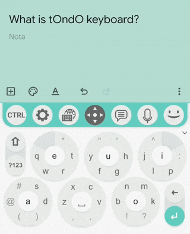
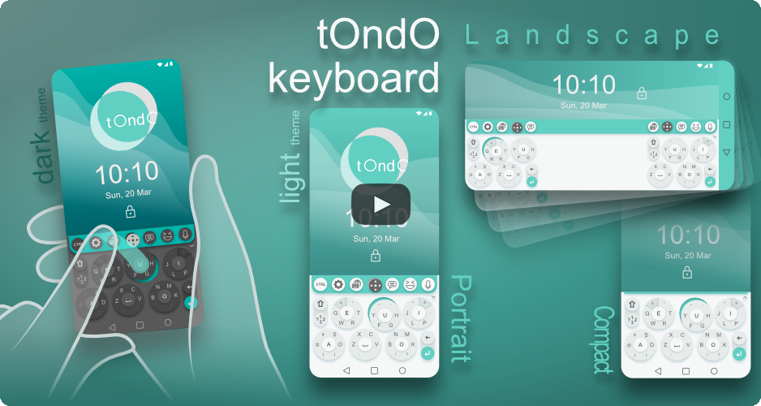
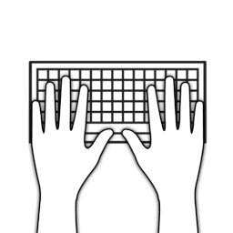
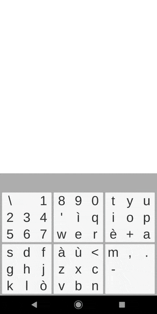
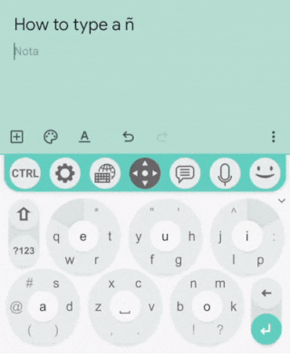
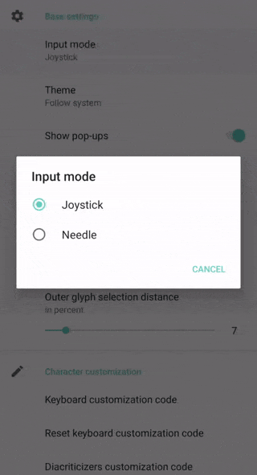
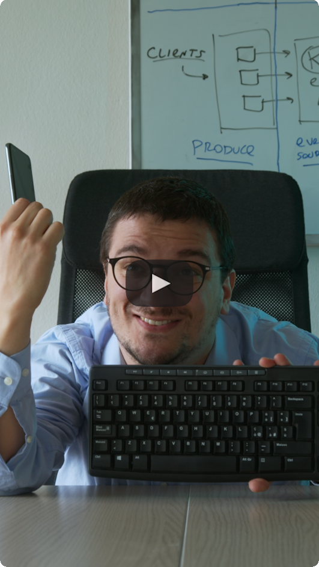

# tOndO keyboard

<!-- hopefully coming soon

-->

A fast, accurate and easy to learn alternative mobile input method.

## What is tOndO keyboard?

tOndO keyboard is an alternative mobile input method designed to reach a few objectives:

* enable the user to write quickly and precisely without the need of constantly looking at the keyboard (getting as close as possible to touch typing);
* let users write in deterministic fashion, avoiding a mandatory usage of autocorrectors and text predictions (or AIs);
* be as easy to learn as possible;
* not be an eyesore and do not occupy too much screen space.

## But why?!

In 2010 8pen came out for Android, and its [video presentation](https://youtu.be/q3OuCR0EpGo) reported an idea that stuck with us since then:  \
_[…] the keyboard was conceived to roughly match the size of human hands: the design worked well and still does […]. This is not the case on today's mobile devices where it is squeezed into barely a couple of inches: not only is it impossible to use two hands but even with a single finger it can be difficult to hit the right key._

Just using a shrunken standard keyboard layout for mobile devices always was, at least, lazy as design.

A few other input methods experimented with non-standard layouts, but we thought they all were too difficult to learn or rely too much on autocompletion (or both) so we decided to create our own unorthodox design.

## Who developed it?

tOndO keyboard is designed and developed by [@rikkarlo](https://github.com/rikkarlo) and [@marcomandy](https://github.com/marcomandy) as a side project. Just Funny Games (now [Funny Tales](https://funnytales.us/)) gave us a hand.

## Wasn’t it just a meme for [r/badUIbattles](https://www.reddit.com/r/badUIbattles/)?

Nope. We developed it unironically. \
It happened that a few comments rightly pointed out to us that it seemed to belong there, so we also posted tOndO on r/badUIbattles.

## How long will it take to learn to write with it?

In our experience, you will be able to write quite reliably right away.

It usually takes 2 or 3 weeks of continuous usage before it stops being so annoying not having your usual keyboard.

## Can you really type fast with it?

Sure!

Current record is 72 WPM and is held by Riccardo Foschi. It was scored on [monkeytype.com](https://monkeytype.com) in English on a 30 seconds duration trial with 10-ish tentative.

[Video proof here](https://youtu.be/zXWKaaur8ZE).

We believe the record could be challenged quite easily with a little bit of training: if you can beat it, share the video or send it to us, and we will share it.

[Here is another tentative](https://youtu.be/4T443q3Aax0) scoring 71 WPM on [10fastfingers.com](https://10fastfingers.com) in Italian (Riccardo mother tongue) on a 60 seconds duration trial.

## Why is there only an Android version? When will it land on iOS?

tOndO's front-end was developed in Unity.

On iOS, [due to a known bug](https://issuetracker.unity3d.com/issues/ios-uaal-after-unloading-a-unity-scene-memory-remains-allocated-depending-on-how-much-memory-was-used-in-the-scene), Unity occupies a lot more memory than necessary and the system has a [very strict policy on memory allocation for app extensions](https://developer.apple.com/library/archive/documentation/General/Conceptual/ExtensibilityPG/ExtensionCreation.html) (such as input methods).

As we never managed to decrement memory usage (or to increment memory availability) the only alternative seems to start developing the front-end from scratch using something different.

We currently do not have an ETA for releasing on iOS, even if we consider it to be a priority.

## Why Unity?

Marco has a few years of experience in developing with Unity.

Unity is not the ideal framework to develop such a lightweight project though, but the initial idea was to only prototype in Unity then move to something else.

Against all expectations, it was possible to include the Unity project exported as a library into an Android input method quite easily and so, the prototype ended up in production.

Unity would also allow developing a cross-platform front-end, but that's revealed to be useless, as explained in the previous answer. 

## Why a QWERTY-like layout?

QWERTY is the most common layout for Latin-script alphabet, and we wanted tOndO to be as familiar and as easy to learn as possible. Furthermore, we liked the idea of sticking to a standard that could work for any language. 

We placed vowels in button centers to make them easy to find, furthermore they are often among the 10 most frequently used letters in most languages with a Latin script alphabet, and since taps are faster than swipes, this also speeds up things.

Layouts like Dvorak are optimized for 10 fingers and their advantages writing on a small device would probably be quite small. Moreover, Dvorak (and also frequency-based layouts, like MessagEase ANIHORTES) are optimized for English and could not give many improvements for other languages.

Anyway, if you are already familiar with a non-QWERTY layout and would like to use it also on tOndO, each letter in the keyboard is customizable so that anyone can create its own layout. Custom layout can be easily exported and imported just copying and pasting the customization code: if you created a layout you are proud of and feel like to share it, please do it on [tOndO Subreddit](https://www.reddit.com/r/tOndOkeyboard).

## Do you know this other quirk input method? What tOndO was inspired from?

We did probably try out every mobile input method and got inspiration from many of them: we already cited 8pen (that was brought back to life by [8vim](https://github.com/8VIM/8VIM) project) and [MessagEase](https://www.exideas.com) (which we were long time users), we love [Gboard](https://play.google.com/store/apps/details?id=com.google.android.inputmethod.latin) and [SwiftKey](https://swiftkey.com), we checked out Katakana keyboard, [Minuum](http://minuum.com/), [Keyboard 69 (Nintype)](https://apps.apple.com/us/app/nintype/id796959534), [NovaKey](https://github.com/vcantu/NovaKey), [Multiling O Keyboard](https://play.google.com/store/apps/details?id=kl.ime.oh), [Typewise](https://www.typewise.app/)…

## Why does an ominous pop-up appear when I enable tOndO keyboard from Android settings?

When enabling tOndO keyboard, an attention pop-up shows up saying “This input method may be able to collect all the text you type, including personal data like passwords and credit card numbers. It comes from the app tOndO keyboard. Use this input method?”: this is a standard message you would get from enabling any third party input method on Android. 

tOndO does not collect any text you type, nor any data at all. We also avoided having the [Connect to the network permission](https://developer.android.com/develop/connectivity/network-ops/connecting) so that tOndO can not access the internet or send any data (as you can check in “App permissions” under the “About this app” category on [tOndO Google Play Store page](https://play.google.com/store/apps/details?id=com.foschia.tondokeyboard)).

Furthermore, all tOndO codebase is open source, you can check by yourself what it’s doing under the hood.

## How do I type ñ or ß or any other accented letter or diacritic glyph?

To input, for example, a “ñ”, type an “n”. A “ń” will appear in the top right spot of the top right button (in the darker niche): typing it will replace the “n” with the “ń”. If you instead select the “ń” and keep it selected for a few instants, the content of the top right button will change to contain other variants of “n”; you can now select “ñ” and type it: if you do so, the next time you will input a “n”, the top right spot of the top right button will display an “ñ” as default.

The top right spot of the top right button and the top left spot of the top left button will always display variants of the last typed character and long-pressing on it will display more variants that, if selected, becomes the default variant for that character.

## Why all this effort just to type an accented letter?

Because the “traditional” long press method, used by most keyboards, requires you to wait a certain time and look at the keyboard to choose the correct accent. On the contrary, with tOndO’s method, you can type the two most used accents for each letter by just swiping twice with no waiting.

## Can you please add a Dvorak-like/Colemak-like/specific language layout?

We are currently not adding new layouts, but it's possible to fully customize each character on the board, so you should be able to create your own custom layout.

You can find "Keyboard customization code" under "Character customization" in tOndO settings. Replacing a character in the code will replace it in the board.

You can also easily copy and paste the customization code in order to keep it for future usage or to share it with someone else. 

If you created an interesting layout and feel like sharing it with the community, please do so on [r/tOndOkeyboard](https://www.reddit.com/r/tOndOkeyboard).

## What unlocking the Pro version would give me?

We tried to include all main features in the standard version. 

Unlocking the Pro version will grant you:

* Unlimited number of changes in the keyboard customization code (Maximum 6 changes allowed otherwise);
* Enable CTRL+A to select all in the CTRL top bar;
* More emojis available in the recently used category;
* Possibility of pinning a larger number of clipboards (20 pinned clipboards with the Pro version, 6 otherwise).

## What’s the point in paying for the Pro version if the app is open source?

If you want to spend the time and are able to build your own tOndO version, go for it! 

Pro version is there if you want to say thank you, and support future developments. 

## How can I build it on my own?

Just open the Android Studio folder as an Android Studio Project and run it. The Unity exported library is already included in the project, but if you need to export it again, you can open Unity folder as a Unity Project (with Unity 2019.4.34f1) and export it in the androidBuild folder.

There also is a Xcode project folder: it also already includes the Unity exported library, but at the current stage it only contains the project structure and can only be launched in debug mode.

## What is your current roadmap?

We don’t have a defined roadmap, but we have a few priorities, that in order of importance are:

* porting the keyboard to iOS;
* creating an interactive tutorial;
* a way to resize keyboard dimensions (that should also make tOndO functional for tablets);
* a way to customize keyboard colors.

We have many more smaller features on our to-do list, and it’s possible we will share them all sooner or later. 

## What’s the difference between joystick input mode and needle input mode?

It’s only an aesthetic difference: when you select a letter with joystick input mode activated, the button will slightly move in the direction of the letter you are selection, as if it was a joystick analog stick; if needle input mode is activated instead, the button will not move and a little colored line will come up from the button center and end in the selected letter, as if it was the needle of a compass.

## Where did the Rotary dial and Onion wheel input mode end up?!

Those were only April’s Fools and were available only for a limited period of time.

You can check screen recordings out [here](https://www.reddit.com/r/badUIbattles/comments/ttpiat/tondo_keyboard_new_update_out_today/?utm_source=share&utm_medium=web2x&context=3) and [here](https://www.reddit.com/r/badUIbattles/comments/128hnjt/another_tondo_keyboard_update_just_for_you_guys/?utm_source=share&utm_medium=web2x&context=3).

If you have any ideas for 2024 April’s Fool, let us know!

## Do you have a known bug list? How can I report a bug?

We will share our bug list as soon as possible! For now, if you find a bug, just write to us via any link in our contacts.

## I have a great idea for a new feature!

As the previous answer: for now, just write to us via any link in our contacts.

## Can I help?

Why not?! Get in touch with us and we will discuss it.

## Can I buy you a coffee?

There you go!

## What about that silly video on your YouTube Channel?

I was starting to fear you would never ask! Thank you for the question.

We love silly things.

It was made in collaboration with our friend of [Collettivo Mandra](https://www.collettivomandra.it/).

## Licenses

tOndO keyboard project is licensed under Apache License 2.0.

See repo's [LICENSE.md](/LICENSE.md) file.

* Emoji artwork is provided by Google Fonts Noto Emoji, released by fonts.google.com on [github.com/googlefonts/noto-emoji](https://github.com/googlefonts/noto-emoji),  licensed under Apache License 2.0.
* Suggestions library WeCantSpell.Hunspell, licensed under an MPL, LGPL, and GPL tri-license and available at [github.com/aarondandy/WeCantSpell.Hunspell](https://github.com/aarondandy/WeCantSpell.Hunspell). Dictionaries licensed under GNU GPL.
* Diff counter customization code Diff Match and Patch under the Apache License Version 2.0, relased by Google on [github.com/google/diff-match-patch](https://github.com/google/diff-match-patch).

## Contacts

[Linktree](https://linktr.ee/tOndO.keyboard) - [Reddit](https://www.reddit.com/r/tOndOkeyboard/) - [Google Play](https://play.google.com/store/apps/details?id=com.foschia.tondokeyboard) - [Instagram](https://instagram.com/tondo.keyboard) - [YouTube](https://www.youtube.com/@tOndO.keyboard) - [Mastodon](https://mastodon.social/@tOndOkeyboard) - [Facebook](https://www.facebook.com/tOndO.keyboard) - [TikTok](https://www.tiktok.com/@tondo.keyboard) - [Product Hunt](https://www.producthunt.com/posts/tondo-keyboard) - [Ko-fi](https://ko-fi.com/tondokeyboard) - [Mail](mailto:tOndO.keyboard@gmail.com)
